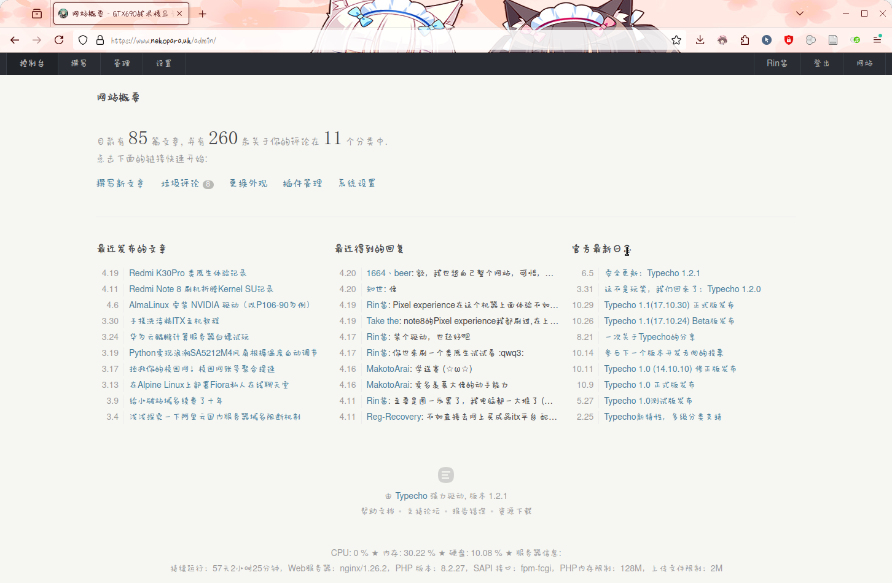
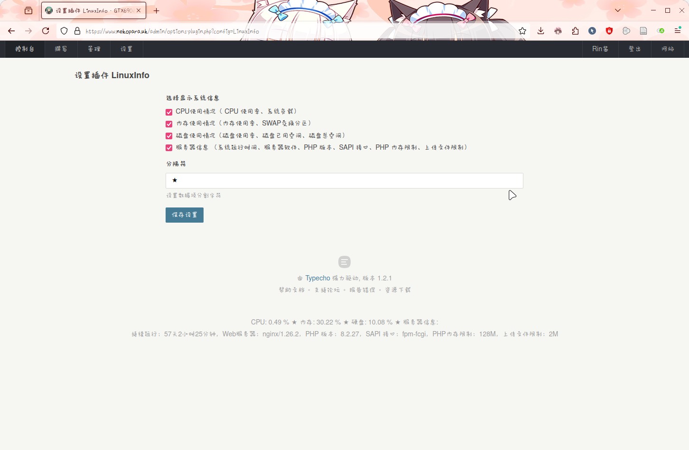

# Typecho-LinuxInfo
 Typecho后台查看服务器信息插件，可以查看CPU占用，内存占用，硬盘占用这些基础信息。
 
 基于<a href="https://www.dbkuaizi.com" target="_blank">两双筷子</a>的插件进行二次开发。
## 使用方法
克隆本仓库到Typecho的插件目录下即可，或者直接创建对应目录将插件`Plugin.php`放入插件特定目录`typecho/usr/plugins/LinuxInfo`，其中`typecho`为typecho网站安装目录。
## 插件效果

    

    

## 注意事项
本插件仅可用于Linux系统，Windows系统不适用。
